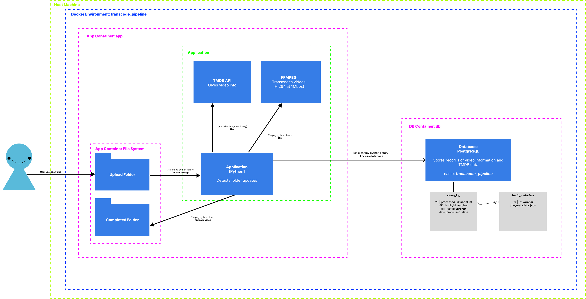

# transcode_pipeline

## How to Run App in Docker Desktop

### One-Time Initial Environment Set-up

1. Rename `variables.env.template` to `variables.env`.

1. Retrieve environment variables from developer (Monica Andres).

1. Fill in environment variables with respective values.

### Run Docker Container

1. In the CLI run `docker-compose up --build --detach`. (`--build` can be omitted after the first run once images are built)

2. Go to `app` container in created `transcode pipeline` container stack in Docker Desktop.
3. Go to the **Files** tab and navigate to `/app/upload/`.

The transcoder pipeline app should be running and listening for video uploads to folder, `/app/upload`, within `app` container's file system, _not_ the host filesystem. This is to keep the application running completely within the Docker container.

Look at `app` container's logs to see real-time logging of app. Upon startup of `app` container, it should display in the **Logs** tab the following message:

```
2023-07-13 14:42:33 - Transcoder pipeline is ready...
2023-07-13 14:42:33 - Listening for folder changes in '/app/upload'...
```

## How To Use App

1. In Docker Desktop, go to `/app/upload` folder on `app` container's file system.

2. Import desired video in the format **<IMDB_ID>.<VIDEO_EXTENSION>**, i.e., `tt1234567.mp4` into the folder from Step 1.

3. Pipeline will detect new file, start pipeline, and display logs as pipeline runs. Logger will first display `----- PIPELINE STARTED... -----` once a file has been uploaded. Note that a logged error message `Pipeline error: <ERROR MESSAGE>` will stop the pipeline instance for that video upload.
4. Once the pipeline successfully runs, the transcoded video will be exported to the folder, `app/completed`, which is also within the `app` container's filesystem.

## Architecture and Implementation Choices



### Tech Stack:

Main Application: **_Python_**
Database: **PostgreSQL**
External Database: **TMDB**
External Libraries: **FFmpeg**
Python Libraries:

- [ffmpeg-python](https://github.com/kkroening/ffmpeg-python)
  - Utilizing a Python wrapper for FFmpeg allows for ease of implementation and readability in the code.
- [watchdog](https://github.com/gorakhargosh/watchdog)
  - Utilizing library to handle file detection for filesystem folders. It provides directory and single file detection.
- [tmdbsimple](https://github.com/celiao/tmdbsimple)
  - Initially utilized `requests` library, however, `tmdbsimple` showed to be a cleaner Python wrapper which utilized Python Objects to represent movies. This conformed better with using SQLAlchemy which is an orm.
- [sqlalchemy](https://www.sqlalchemy.org/)
  - `SQLAlchemy` is a common Python toolkit and ORM for SQL. It is easier to implement for a demo-level project, and it allows easier inserts into the db.
